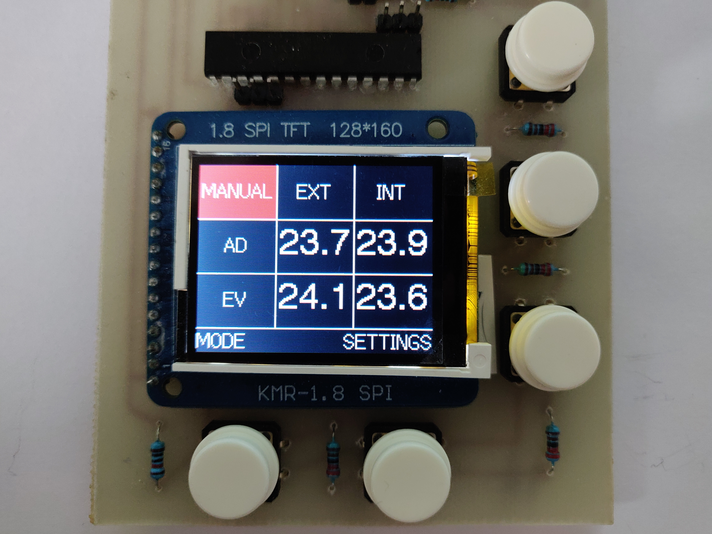
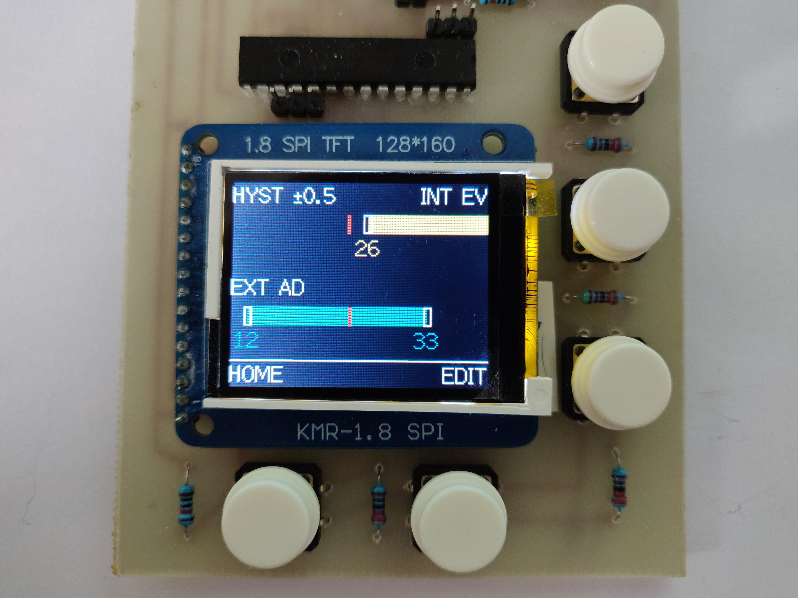
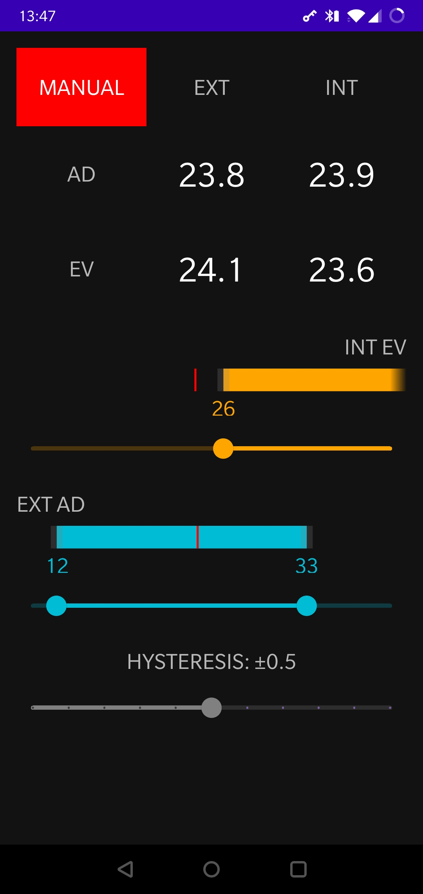
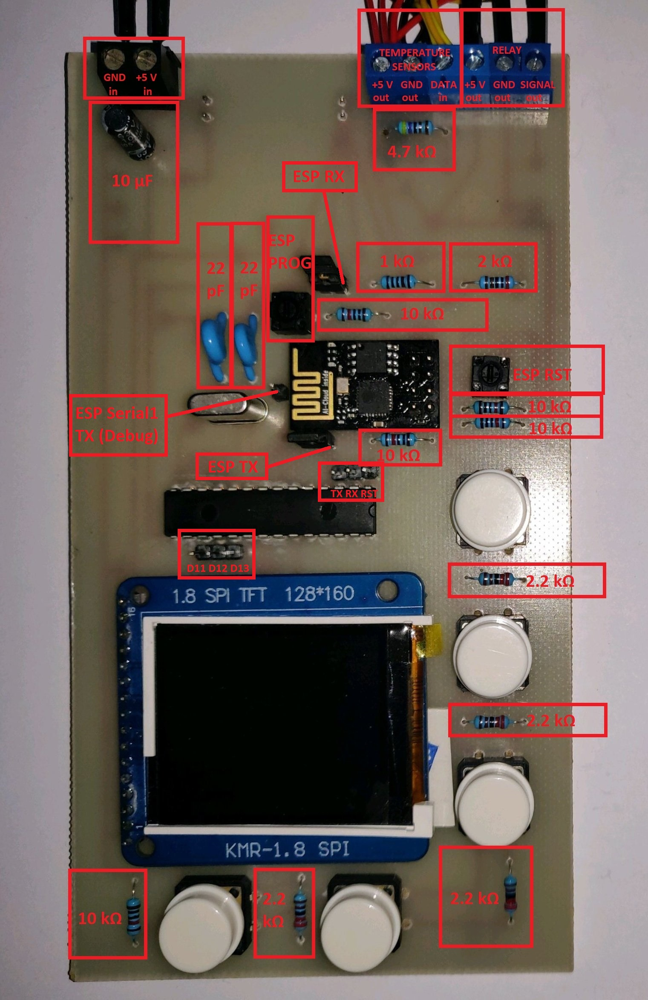
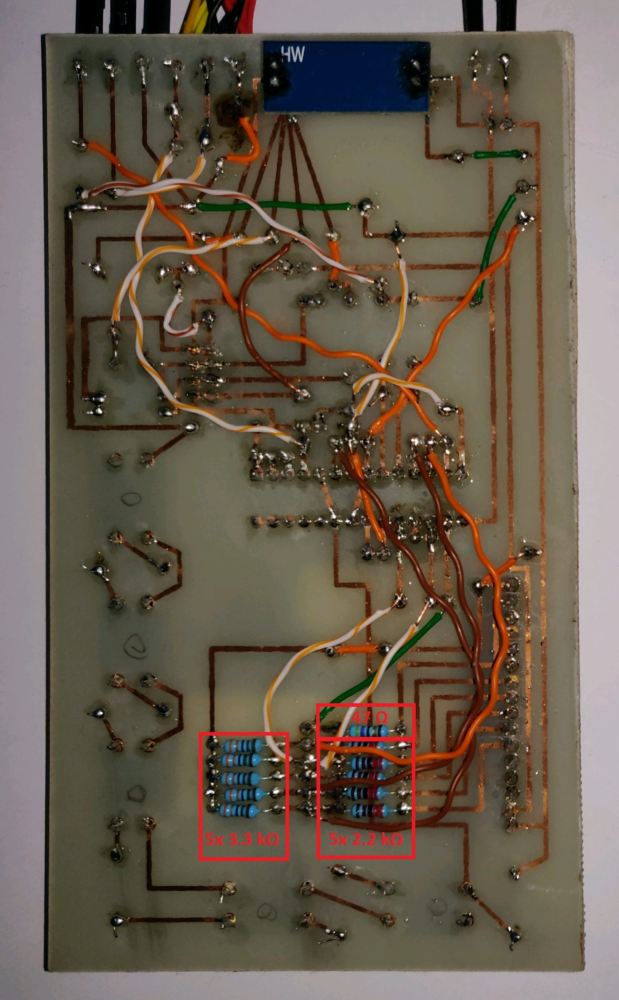
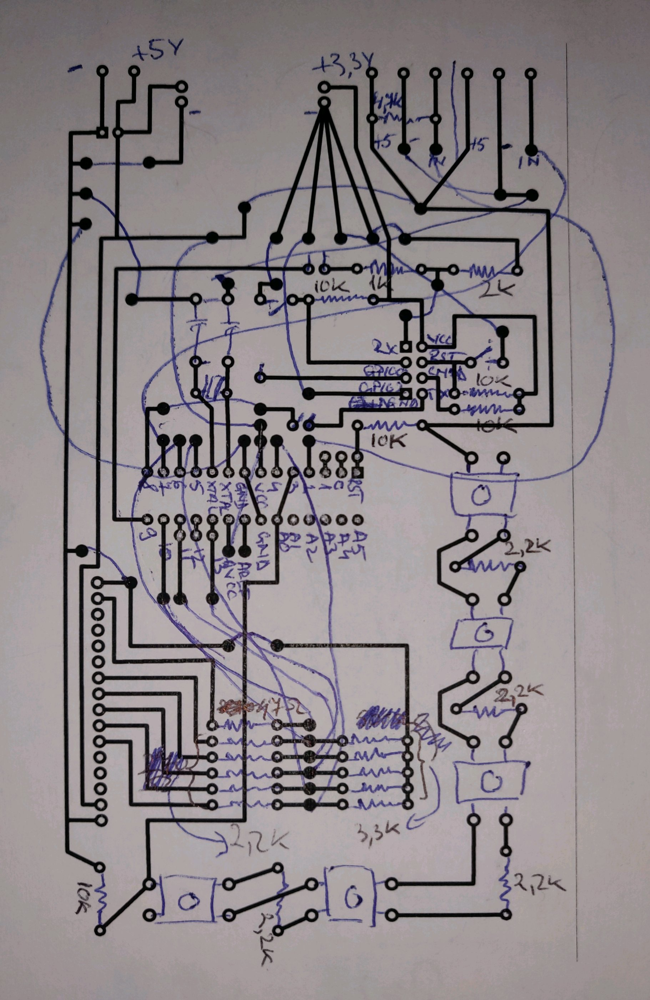

# MVHR Bypass

IOT device able to control the [MVHR Summer Bypass](https://www.zehnder.co.uk/summer-bypass) based on inside and outside temperatures.

## Compilation

Both the [**mvhr-bypass-arduino**](https://github.com/radusalagean/mvhr-bypass-arduino) and the [**mvhr-bypass-esp8266**](https://github.com/radusalagean/mvhr-bypass-esp8266) projects can be edited and compiled with **VSCode**, which needs the **Arduino IDE** installed and the following **VSCode plugins**:

- [Arduino](https://marketplace.visualstudio.com/items?itemName=vsciot-vscode.vscode-arduino)
- [C/C++](https://marketplace.visualstudio.com/items?itemName=ms-vscode.cpptools)

### Dependencies and versions

Check the **release notes** for each MVHR Bypass repo for the latest dependency versions known to work with that specific release.

In addition, the  **mvhr-bypass-arduino** project relies on the [**TFT_ILI9163**](https://github.com/radusalagean/TFT_ILI9163) library, which is included as a git submodule.

The **mvhr-bypass-common** repository contains code which is shared by both **mvhr-bypass-arduino** and **mvhr-bypass-esp8266** and is included in those repos as a git submodule.

### Software version compatibility

Add a new entry every time a new version is released. New releases go on top.

| [mvhr-bypass-arduino](https://github.com/radusalagean/mvhr-bypass-arduino) | [TFT_ILI9163](https://github.com/radusalagean/TFT_ILI9163)   | [mvhr-bypass-esp8266](https://github.com/radusalagean/mvhr-bypass-esp8266) | [mvhr-bypass-common](https://github.com/radusalagean/mvhr-bypass-common) | [mvhr-bypass-android](https://github.com/radusalagean/mvhr-bypass-android) |
| ------------------------------------------------------------ | ------------------------------------------------------------ | ------------------------------------------------------------ | ------------------------------------------------------------ | ------------------------------------------------------------ |
| [1.0.0](https://github.com/radusalagean/mvhr-bypass-arduino/releases/tag/v1.0.0) | [1.0.0](https://github.com/radusalagean/TFT_ILI9163/releases/tag/v1.0.0) | [1.0.0](https://github.com/radusalagean/mvhr-bypass-esp8266/releases/tag/v1.0.0) | [1.0.0](https://github.com/radusalagean/mvhr-bypass-common/releases/tag/v1.0.0) | [1.0.0](https://github.com/radusalagean/mvhr-bypass-android/releases/tag/v1.0.0) |

### Flashing software updates on ATmega328p

Available options:

1. [Flashing with a **USB to Serial converter**](https://youtu.be/Sww1mek5rHU?t=1800)

1. Using an **Arduino board as an ISP**:

    - Write the **ArduinoISP** sketch which is included with Arduino IDE (located in File -> Examples -> ArduinoISP)

    - Hook up the Arduino Uno to the ATmega328p *(Double check the sketch in case these change in future versions)*:

    | Arduino Uno Pin | ATmega328p Pin |
    | --------------- | -------------- |
    | D10             | RST            |
    | D11             | D11            |
    | D12             | D12            |
    | D13             | D13            |
    - In VSCode, select the **Arduino as ISP** programmer and then run the **Arduino: Upload Using Programmer** command.

### Flashing software updates on ESP8266

Available options:

1. **OTA Update:**
   
   - Have the PC connected to the **same network** as ESP8266
   - In VSCode, in `arduino.json`, set the `port` value to the current IP address of the ESP8266
   - Upload
2. **Direct Serial Flashing:**
   
   - On the Arduino board, hook up the **RST** pin to **GND** (this bypasses the onboard microcontroller so you can use just the built in USB to Serial functionality)
   
   - **Remove the two header jumpers** that allow the ESP8266 and the ATmega328p to communicate through serial
   
   - Hook up the Arduino board to the ESP8266:
   
     | Arduino Pin | ESP8266 Pin                      |
     | ----------- | -------------------------------- |
     | RX          | RX (through the voltage divider) |
     | TX          | TX                               |
   
   - Get the ESP8266 in **Program Mode**:
     - Press and hold the **ESP RST micro-switch**
     - Press and hold the **ESP PROG micro-switch**
     - Release the **ESP RST micro-switch**
     - Release the **ESP PROG micro-switch**
   - In VSCode, select the appropriate **Serial port**
   - Upload
   - Press the **ESP RST micro-switch** to reset to normal mode

### Receiving serial messages for debugging purposes

- On the Arduino board, hook up the **RST** pin to **GND**

- For the **ATmega328p**, hook up:

  | Arduino Pin | ATmega328p Pin |
  | ----------- | -------------- |
  | TX          | TX             |
  
- For the **ESP8266**, hook up:

  | Arduino Pin | ESP8266 Pin |
  | ----------- | ----------- |
  | TX          | Serial1 TX  |

- Open the **Serial Monitor** and set the baud rate to **9600 bps**

## Hardware

- 1x 2 pin screw connector
- 1x 6 pin screw connector (or 2x 3 pin)
- 1x AMS1117 module (3.3 V)
- 1x 10 µF capacitor
- 1x ATmega328P-PU
- 2x 22 pF capacitors
- 1x 16 MHz crystal
- 1x ESP8266-01 (labeled "AI-Cloud inside")
- 5x push buttons (4 pin)
- 2x micro-switches (2 pin)
- 2x header jumpers (2 pin)
- 11x header pins
- 1x ILI9163 1.8" SPI TFT 128*160 (labeled "KMR-1.8 SPI")
- 1x 47 Ω resistor
- 1x 1 kΩ resistor
- 1x 2 kΩ resistor
- 9x 2.2 kΩ resistor
- 5x 3.3 kΩ resistor
- 1x 4.7 kΩ resistor
- 5x 10 kΩ resistor
- 1x Relay (5 V)
- 4x DS18B20 Temperature sensors

### PCB

### Wiring

